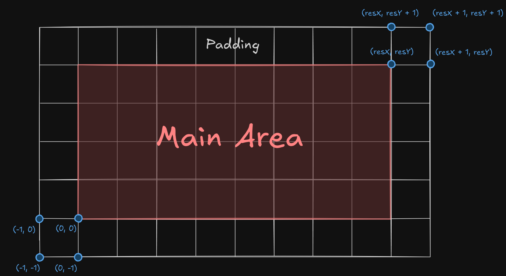

**Сетка** (`Grid`) - базовый класс, содержащий основные параметры, необходимые для задания сетки: точку начала отсчета, число ячеек по обеим осям и размеры одной ячейки. Долнительно, реализован параметр `padding`, определяющий кол-во дополнительных ячеек по краям сетки. 

Важно понимать, что класс `Grid` не содержит каких-либо структур для хранения данных в сетке. Это обусловлено тем, что в разных сетках (`ParticleGrid`, `FieldGrid`) данные хранятся в разных элементах сетки: в сетке частиц данные хранятся в ячейках, а в сетке поля - в узлах.

### Ссылки:
* [Field Grid](Field%20Grid.md)
* [Particle Grid](Particle%20Grid.md)