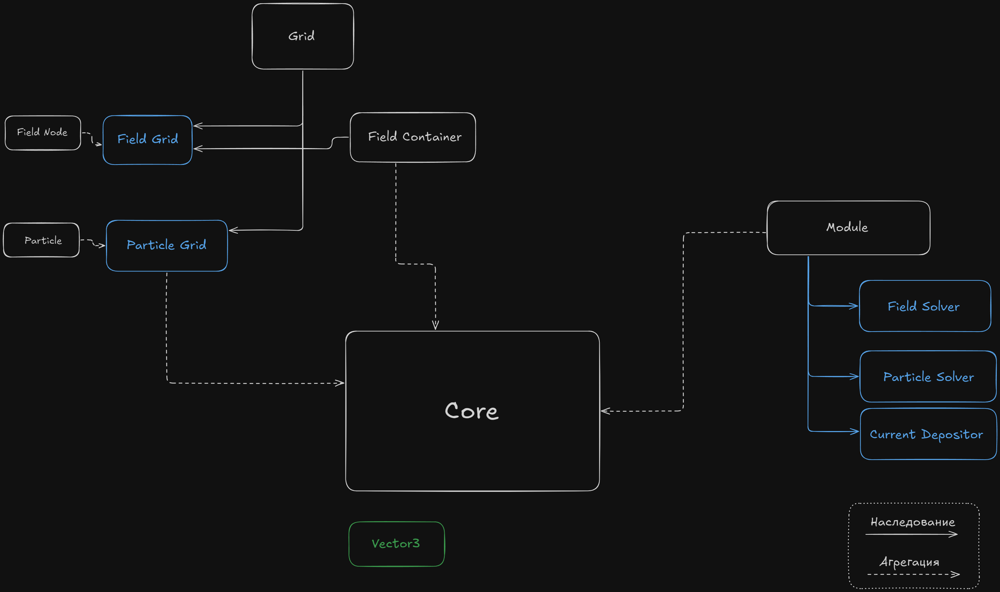

### Что такое PICADOR Jr?

#NeedsWriting

### Как использовать PICADOR JR?

[User Guide](User%20Guide.md)

### Архитектура PICADOR Jr

* Базовые элементы:
	* [PICADOR Jr Core](PICADOR%20Jr%20Core.md)
	* [Module](Module.md)
	* [Grid](Grid.md)
	* [Field Container](Field%20Container.md)
	* [Field Grid](Field%20Grid.md)
	* [Particle](Particle.md)
	* [Particle Grid](Particle%20Grid.md)
	* [Vector3](Vector3.md)
	* [Constants](Constants.md)

* Модули:
	* [Field Solver](Field%20Solver.md)
	* [Particle Solver](Particle%20Solver.md)
	* [Current Depositor](Current%20Depositor.md)