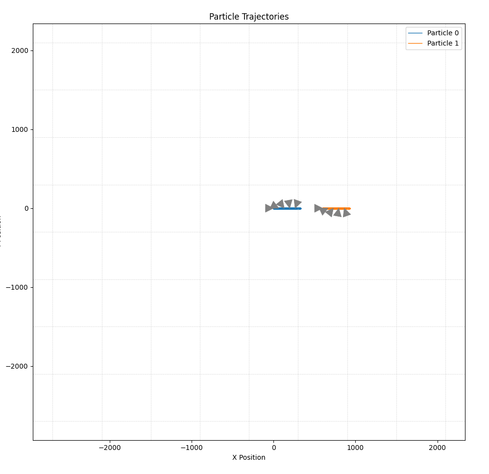
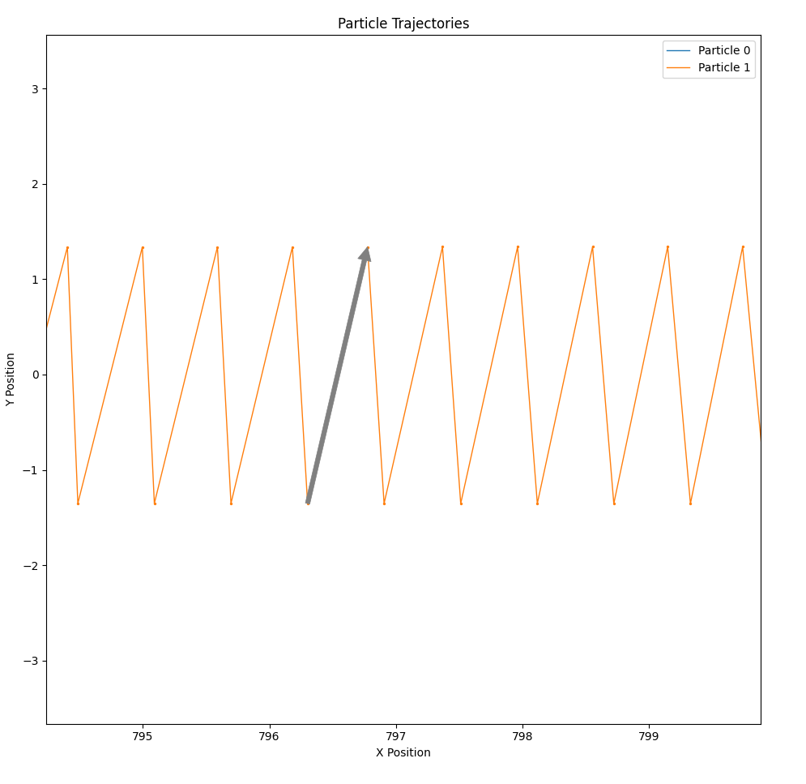
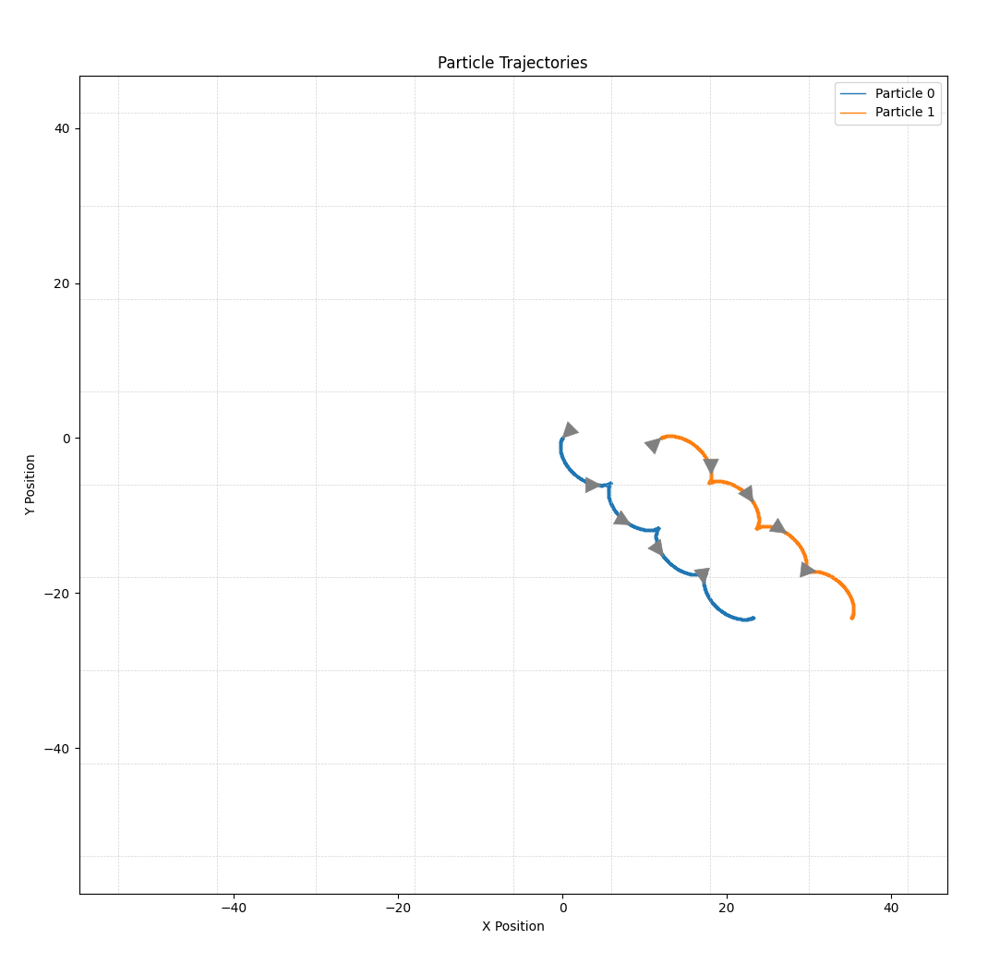
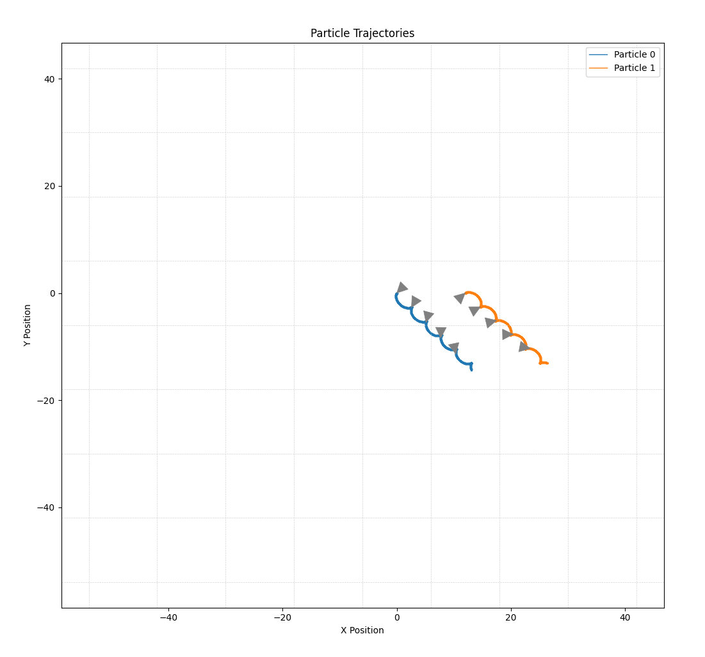
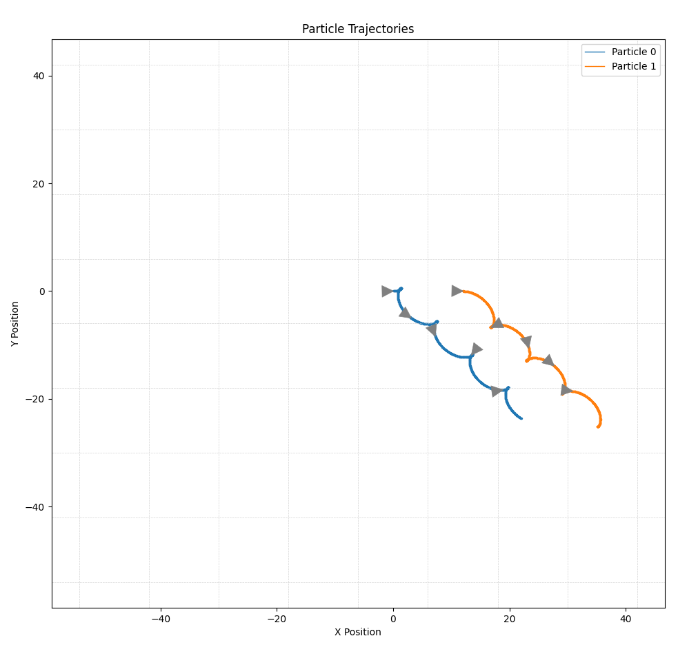
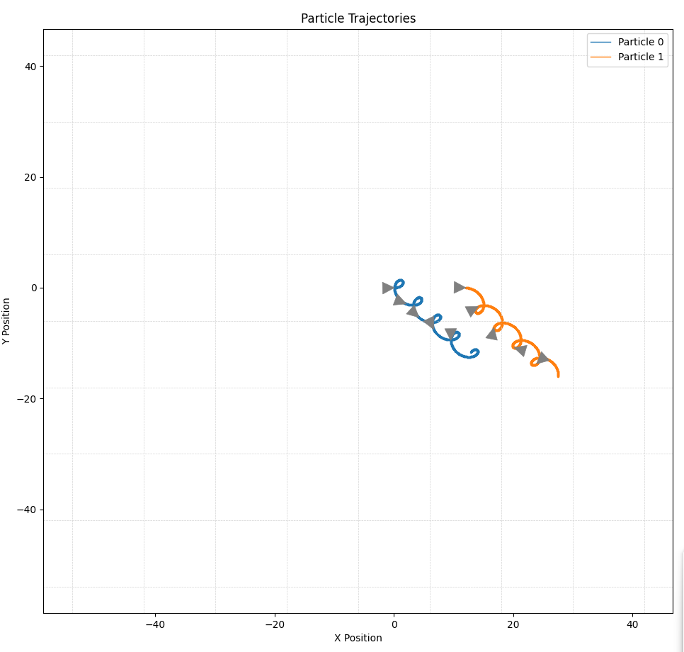

# 1. Test Experiment

### Experiment parameters

```c++
size_t numInterations = 1100;
double timeStep = 1e-8;

size_t resolution = 9;
double spaceStep = Constants::SpeedOfLight * timeStep * 2;

Vector3 E = Vector3(0, 0.01 * Constants::SpeedOfLight * 1e3 / Constants::SpeedOfLight);
Vector3 B = Vector3(0, 0, 1e4);
    
std::vector<Particle> particles = 
{
    Particle(
	    // Mass
	    Constants::ElectronMass,  
	    // Charge 
	    Constants::ElectronCharge,
	    // Initial Location
	    Vector3::Zero,             
	    // Initial Velocity
	    Vector3(Constants::ElectronMass * 0.01 * Constants::SpeedOfLight, 0, 0)
	    ),
	    
    Particle(
	    Constants::ElectronMass,   
	    -1 * Constants::ElectronCharge,   
	    Vector3(spaceStep, 0, 0),     
	    Vector3(Constants::ElectronMass * 0.01 * Constants::SpeedOfLight, 0, 0)
	    )
};
```

### Results







# 2. Second Test Experiment

### Experiment parameters

```c++

size_t numInterations = 1100;
double timeStep = 2e-12;

size_t resolution = 9;
double spaceStep = 11.9917;

// First run
Vector3 E = Vector3::VectorMaskXY.normalized() * 500;

// Second run
Vector3 E = Vector3::VectorMaskXY.normalized() * 300;


Vector3 B = Vector3(0, 0, 1e3);

std::vector<Particle> particles =
{
    Particle(
	    Constants::ElectronMass,   
	    Constants::ElectronCharge,        
	    Vector3::Zero,                
	    Vector3(0, 0, 0)
	    ),

    Particle(
	    Constants::ElectronMass,   
	    -1 * Constants::ElectronCharge,   
	    Vector3(spaceStep, 0, 0),     
	    Vector3(0, 0, 0)
	    )
};
```


### Results Run 1



### Results Run 2




# 3. Third Test Experiment

### Experiment parameters

```c++

size_t numInterations = 1100;
double timeStep = 2e-12;

size_t resolution = 9;
double spaceStep = 11.9917;

// First run
Vector3 E = Vector3::VectorMaskXY.normalized() * 500;

// Second run
Vector3 E = Vector3::VectorMaskXY.normalized() * 300;


Vector3 B = Vector3(0, 0, 1e3);

std::vector<Particle> particles =
{
    Particle(
	    Constants::ElectronMass,   
	    Constants::ElectronCharge,        
	    Vector3::Zero,                
	    Vector3(Constants::ElectronMass * 3e10, 0, 0)
	    ),

    Particle(
	    Constants::ElectronMass,   
	    -1 * Constants::ElectronCharge,   
	    Vector3(spaceStep, 0, 0),     
	    Vector3(Constants::ElectronMass * 3e10, 0, 0)
	    )
};
```


### Results Run 1


### Results Run 2

