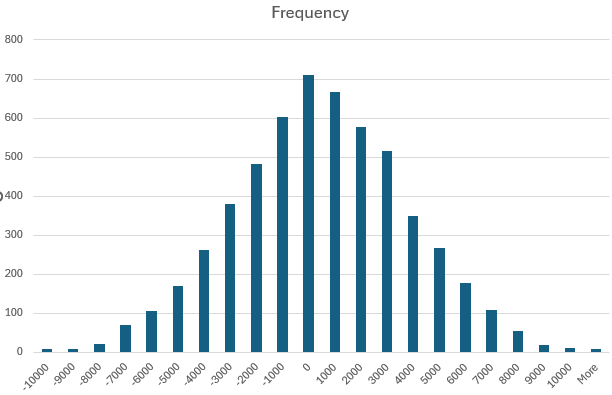
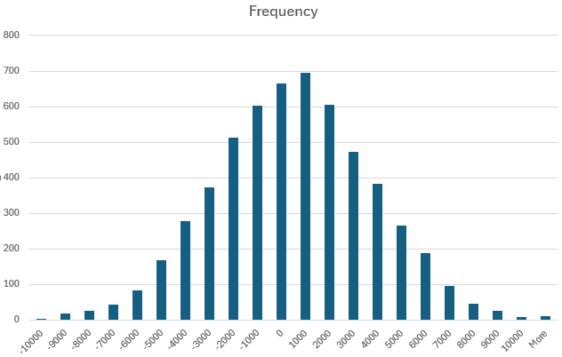
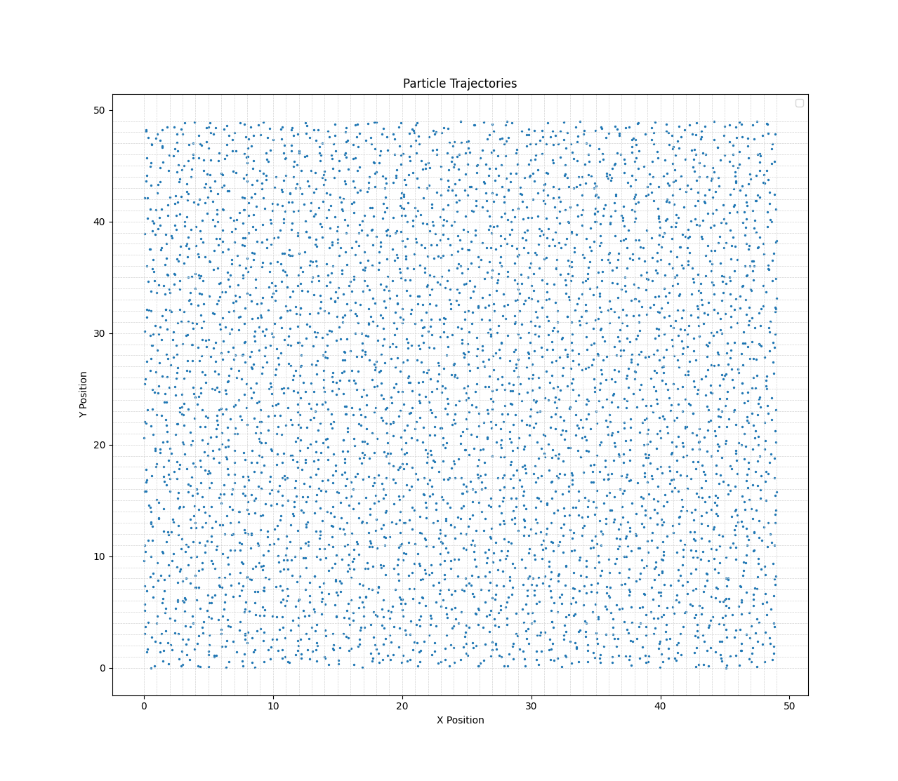
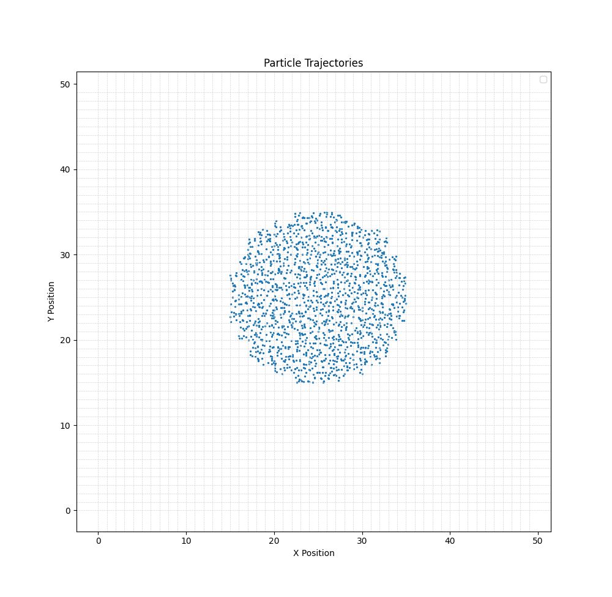
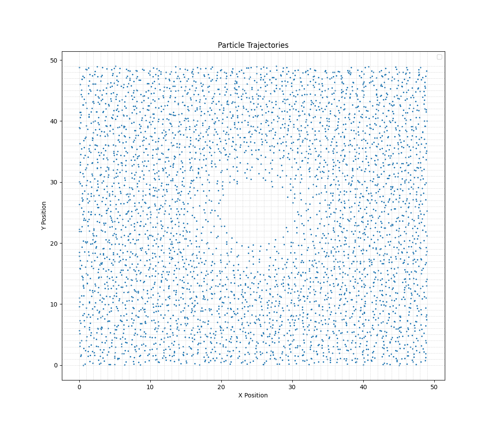
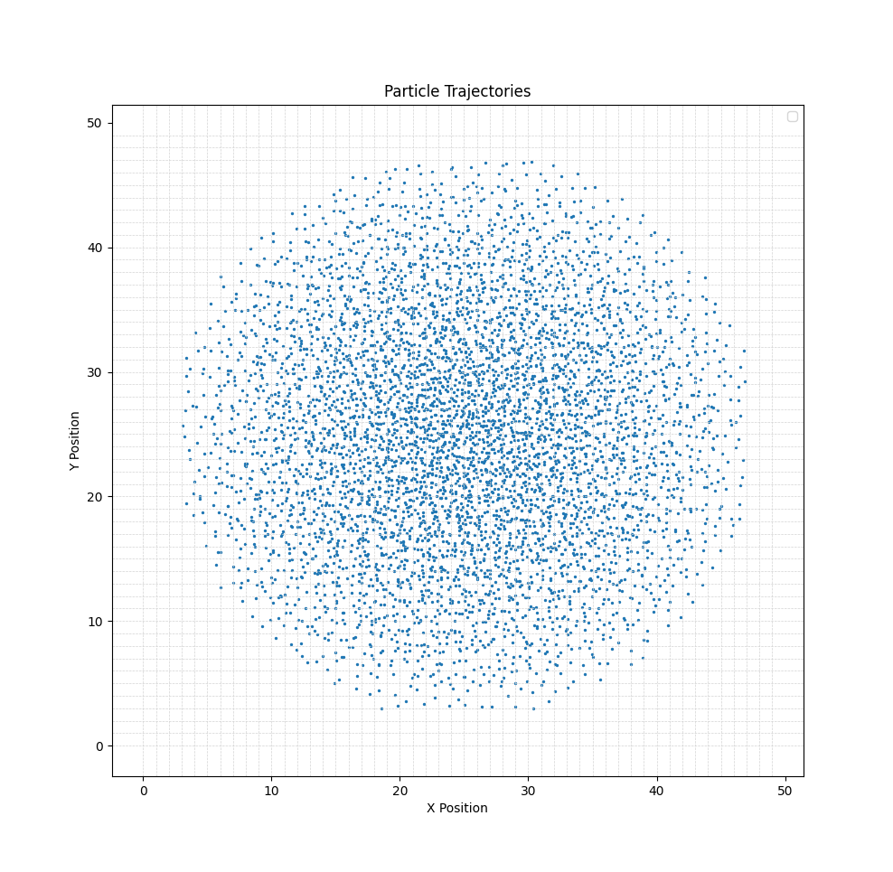
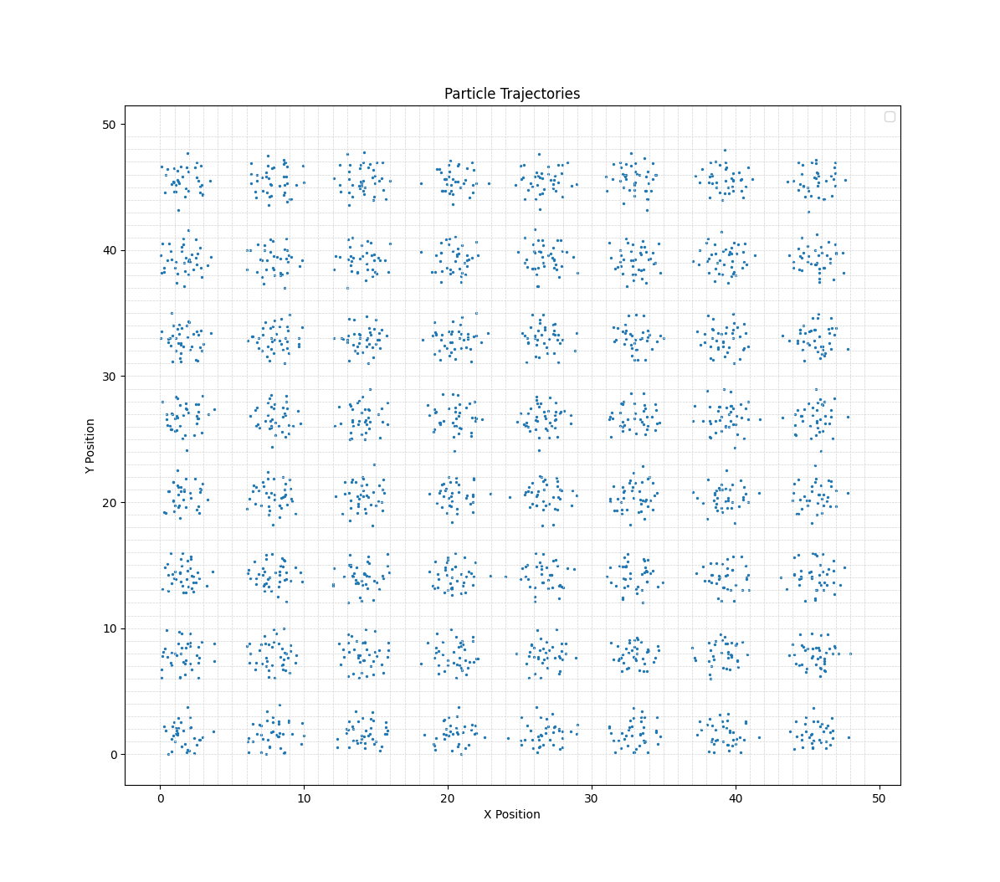

#Experiment
# Velocity Distribution

```c++
profile.temperatureFunction = [](Vector3) { return 1e-20; };
```

### Velocity Distribution Along X Axis



### Velocity Distribution Along Y Axis




# Location Distribution Examples
### Constant

```c++
profile.particleDensityFunction = [](Vector3 location ) { return 2; };
```



### Radial Mask

```c++
profile.particleDensityFunction = [](Vector3 location ) { return ( (location - Vector3(25, 25)).size() < 10 ? 5 : 0 ); };
```



### Inverted Radial Gradient

```c++
profile.particleDensityFunction = [](Vector3 location ) { return ( min(1.0, (location - Vector3(25, 25)).size() / 10) * 2); };
```



### Radial Gradient

```c++
profile.particleDensityFunction = [](Vector3 location ) { return ( (1 - min(1.0, (location - Vector3(25, 25)).size() / 25)) * 10); };
```



### Grid-Like Distribution

```c++
profile.particleDensityFunction = [](Vector3 location ) { return ( max(sin(location.x) * 3 + sin(location.y) * 3, 0) ); };
```
