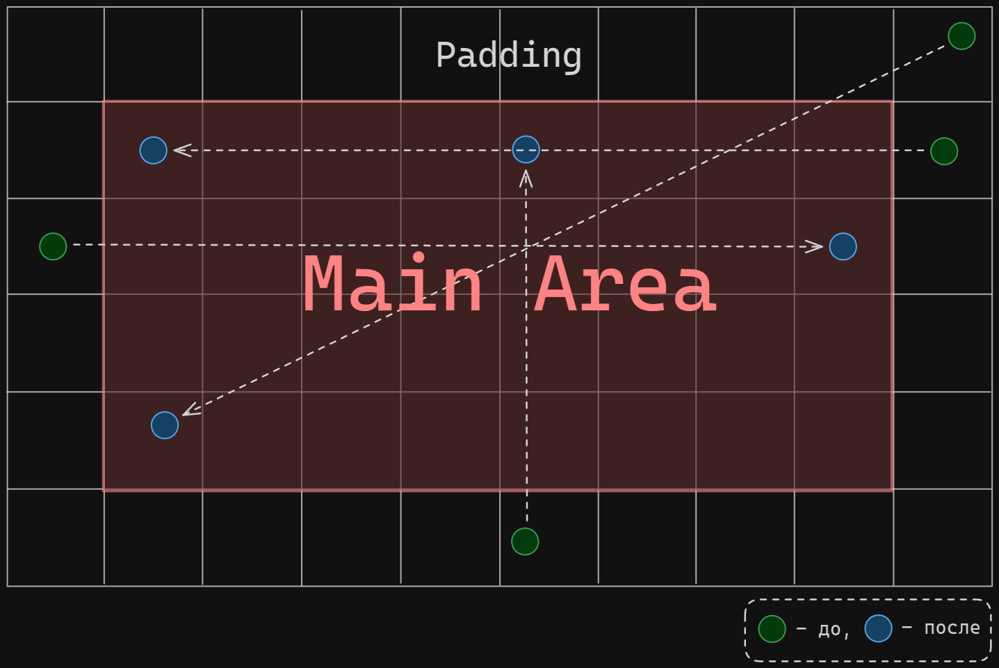

#Module 

### Описание модуля

Модуль `ParticleLoopEdgeCondition` предназначен для обработки циклических граничных условий движения частиц. 

Во время своего движения частицы могут покинуть пределы основной области сетки и выйти в дополнительные ячейки - `padding`. Данный модуль перемещает все частицы, находящиеся в дополнительных ячейках по принципу, указанному на рисунке. 

### Конфигурация модуля

-
### Реализация

Метод `onBegin()`, вызываемый ядром перед началом симуляции, проверяет наличие у сетки частиц дополнительных ячеек (`padding > 0`). Если дополнительные ячейки отсутствуют, метод возвращает `ModuleExecutionStatus::Error`, что приводит к отключению модуля ядром.

Метод `onUpdate()`, вызываемый ядром каждую итерацию симуляции, проходит по всем дополнительным ячейкам, прилегающим к основной области сетки. Такое обход обусловлен тем, что, при корректных настройках симуляции, за одну итерацию частица не может переместиться дальше чем в соседнюю ячейку. Поскольку на конец текущей итерации все частицы будут перемещены из дополнительных ячеек в основную область, ни одна частица не сможет попасть в дополнительные ячейки, расположенные за непосредственно прилегающими к основной области сетки.

Для каждой ячейки вызывается метод `processPaddingCell`. Этот метод вычисляет индексы ячейки, в которую должно происходить перемещение частиц (с помощью метода `calculateLoopingCell`), затем проходит по всем частицам ячейки и осуществляет соответствующее перемещение.

### Тестирование

Все тесты проводились на сетке $3 \times 3$ ячейки с `padding` = 1, следовательно, итоговое разрешение сетки $4 \times 4$ ячейки. Проводились следующие тесты:

1. Корректность работы для одной частицы, находящейся в одной из дополнительных ячеек (проверялось для всех ячеек);
2. Корректность работы для случая, когда в каждой дополнительной ячейке находится по одной частице;
3. Корректность работы для случая, когда в каждой дополнительной ячейке находится несколько частиц.

### Ссылки
* [Particle Grid](../Basic/Particle%20Grid.md)
* [Module](../Basic/Module.md)