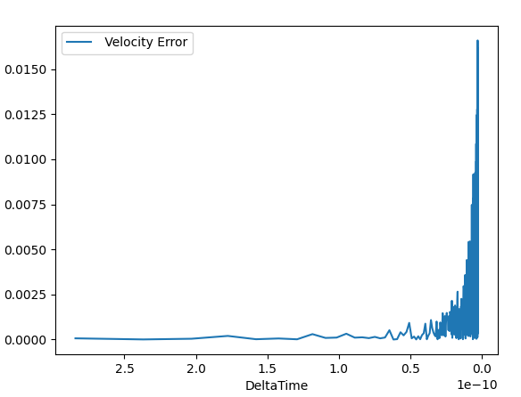
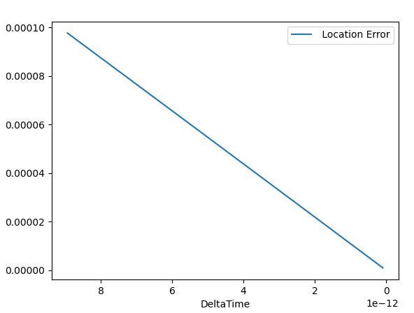
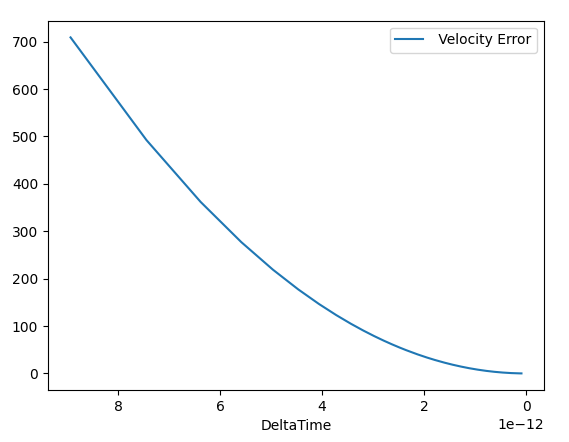
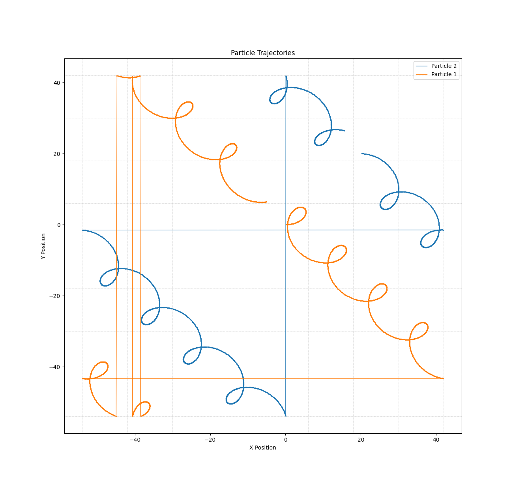
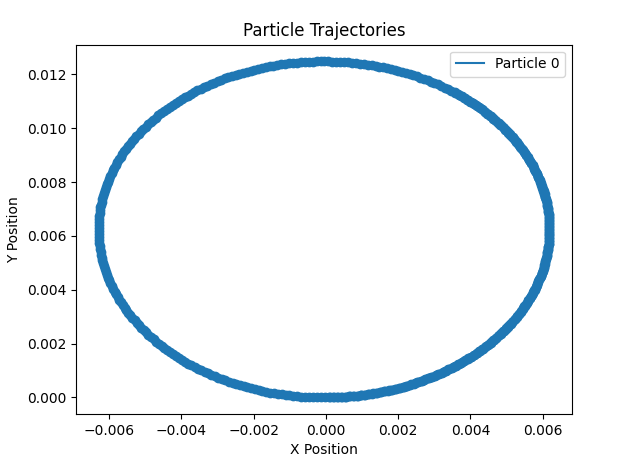
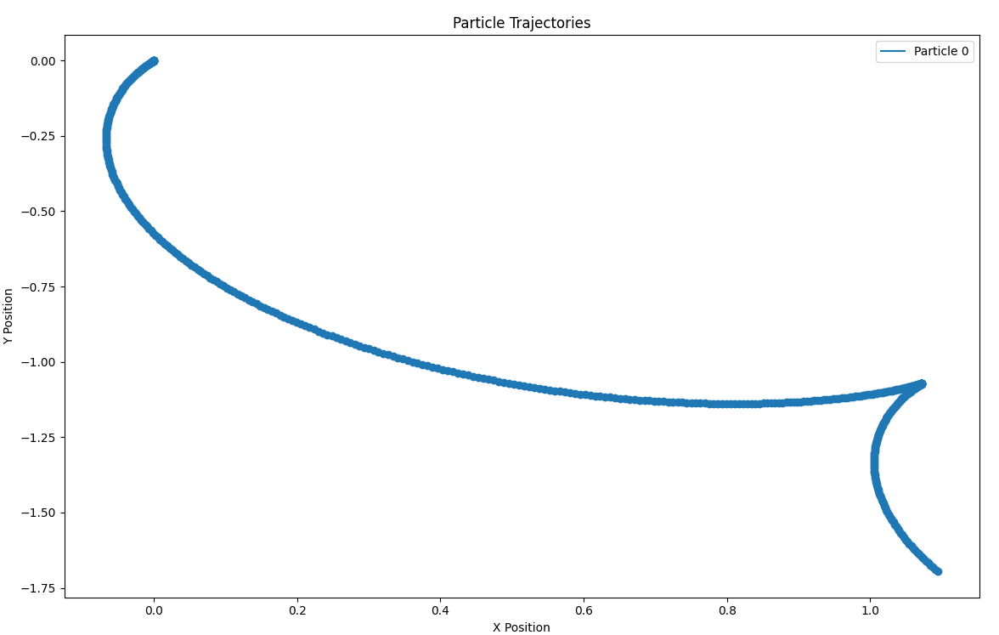
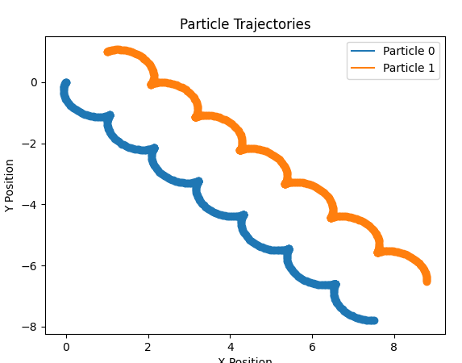
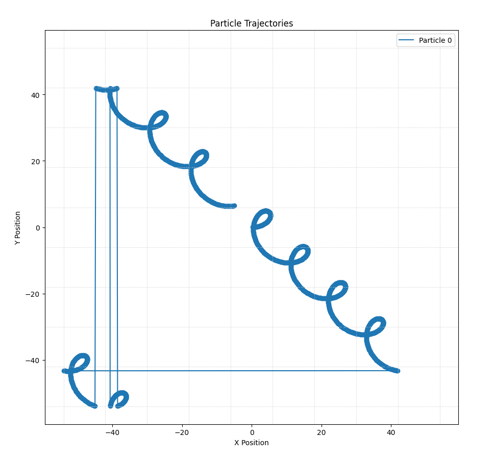

#NeedsWriting

Графики сходимости метода Бориса

*Горизонталь:   Временной Шаг (в сторону уменьшения)
*Вертикаль:     Абсольтная ошибка;

**Тест Релятевистское усорение в статическом поле"

**Тест Осциляция в статическом поле"

c * dt / dx < 1

