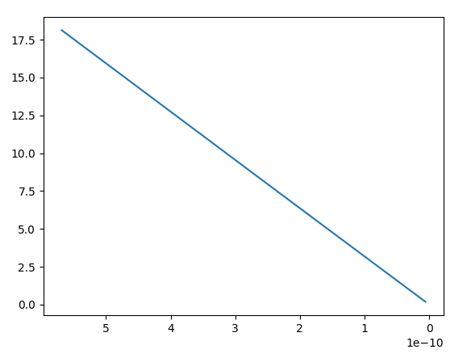
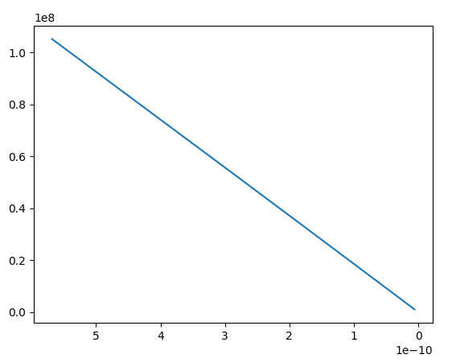

#NeedsWriting

Графики сходимости на эксперименте "Релятевистское усорение в статическом поле"

*Горизонталь:   Временной Шаг (в сторону уменьшения)
*Вертикаль:     Абсольтная ошибка;

Сходимость ошибки положения:

Сходимость ошибки по скорости:

**Хотя ошибка и уменьшается линейно (это хорошо), её модуль очень большой!