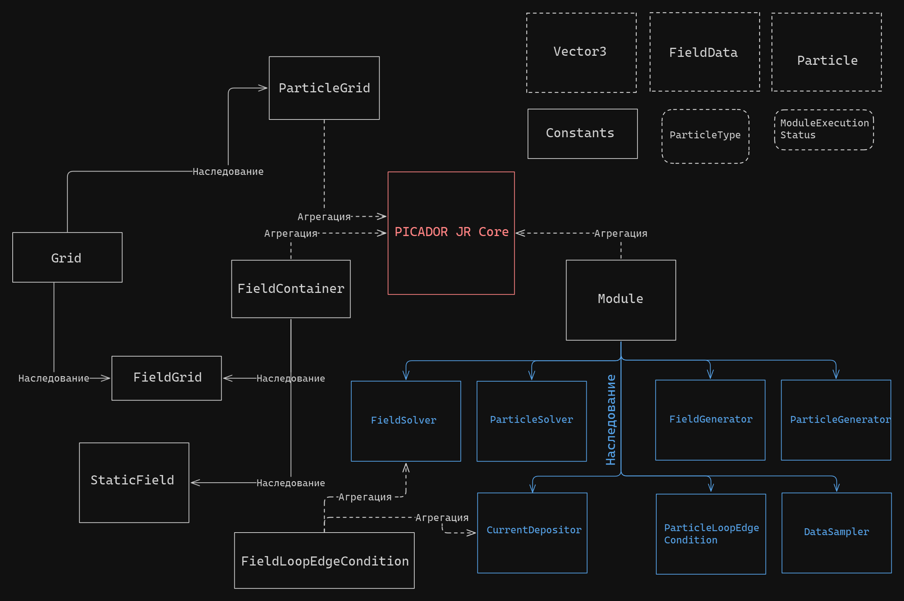

#Report

# Ядро

Центральным элементом системы является **ядро** - `PicadorJrCore`. Ядро отвечает за обработку главного цикла симуляции, вызов основных методов модулей и предоставление им доступа к информации об электромагнитном поле и частицах.

Ядро содержит указатели на используемый **контейнер поля** (`FieldContainer`) и **Сетку частиц** (`ParticleGrid`), а также список (массив) используемых модулей. Добавление модулей осуществляется посредством специального метода ядра - `insertModule()`.

# Модули

**Модули** - компоненты системы, осуществляющие все основные расчеты. Каждый реализованный модуль наследуется от абстрактного класса `Module`, содержащего три основных абстрактных метода `onBegin()`, `onUpdate()` и `onEnd()`, которые вызываются ядром до начала симуляции, каждую итерацию симуляции и после окончания симуляции соответственно. Каждый метод возвращает значение типа `ModuleExecutionStatus`, которое может принимать два значения: `Success` и `Error`. Если после вызова одного из методов модуль вернул значение `Error`, ядро исключает его из списка модулей и далее его не использует.

Перечень реализованных в текущей версии модулей:
1. `FieldSolver` - вычисляет и обновляет значения электромагнитного поля;
2. `ParticleSolver` - вычисляет скорости частиц и обрабатывает их перемещение в пространтсве;
3. `CurrentDepositor` - вычисляет и записывает в сетку значения токов, создаваемых движущимися частицам;
4. `FieldGenerator` - генерирует начальные значения в сетке поля;
5. `ParticleGenerator` - генерирует начальное положение и скорости частиц в соответсвии с заданными параметрами распределения;
6. `ParticleLoopEdgeCondition` - циклические граничные условия для движения частиц;
7. `DataSampler` - собирает информацию о состоянии физической системы на протяжении всей симуляции и записывает результаты в файлы.

# Сетка

**Сетка** (`Grid`) - базовый класс, содержащий основные параметры, необходимые для задания сетки: точку начала отсчета, число ячеек по обеим осям и размеры одной ячейки. Долнительно, реализован параметр `padding`, определяющий кол-во дополнительных ячеек по краям сетки. 

Важно понимать, что класс `Grid` не содержит каких-либо структур для хранения данных в сетке. Это обусловлено тем, что в разных сетках (`ParticleGrid`, `FieldGrid`) данные хранятся в разных элементах сетки: в сетке частиц данные хранятся в ячейках, а в сетке поля - в узлах.

# Электромагнитное поле

Информация об электромагнитном поле в некоторой точке представляется структурой `FieldData`, содержащей три трехмерных векторных значения:
* `E` - электрическое поле;
* `B` - магнитное поле;
* `J` - токи, создаваемые частицами.

В такой форме информация о поле хранится в Контейнере поля. `FieldContainer` - абстрактный класс, являющийся базовым для всех контейнеров поля.

В текущей версии реализованы два контейнера поля:
* Статическое поле (`StaicField`);
* Сетка поля (`FieldGrid`), содержащая информацию о множестве точек двумерного пространства (основной контейнер поля).

# Частицы

Данные об одной частице хранятся в структуре `Particle`, содержащей всю основную физическую информацию о типе чатицы (тип, масса, заряд), положении и движении частицы в пространтсве (положение и импульс), а также такие параметры как "вес", флаг перехода в другую ячейку и индекс отслеживания (для сбора данных о траектории частиц).

Заметим, что вместо скорости в структуре `Particle` хранится импульс. Такое решение обусловлено формулами, используемыми в вычислениях движения частиц. Вместе со структурой предоставлены методы перевода импульса в скорость и обратно.

Множество частиц (ансамбль) хранится в сетке частиц (`ParticleGrid`). В каждой ячейке сетки хранится массив содержащихся в ней частиц. При движении частицы могут покидать пределы своих ячеек, в таком случае они перекладывается в другие ячейки. Размеры ячеек должны выбираться в соответсвтии со следующим условием: за одну итерацию симуляции частица не может переместится дальше чем в соседнюю ячейку.

Схема хранения частиц по ячейкам предназначена для эффективной параллельной обработки движения частиц, но в текущей версии программы такая возможность не реализована.

# Другие структуры и классы

### Vector3

`Vector3` - структура, используемая для представления трехмерных векторов. В её реализацию входят все необходимые операции и функции веторной математики:
* Сложение, вычитание;
* Покомпонентное умножение и деление;
* Умножение на число;
* Скалярное произведение;
* Векторное произведение;
* Взятие длины вектора;
* Нормализация (приведение к единичному вектору).

### Constants

`Constants` - класс, содержащий несколько статических полей, представляющих собой набор необходимых в вычислениях физических постоянных (в СГС):
* Скорость света;
* Масса электрона;
* Заряд электрона;
* Значение числа $\pi$.

